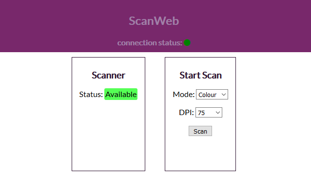
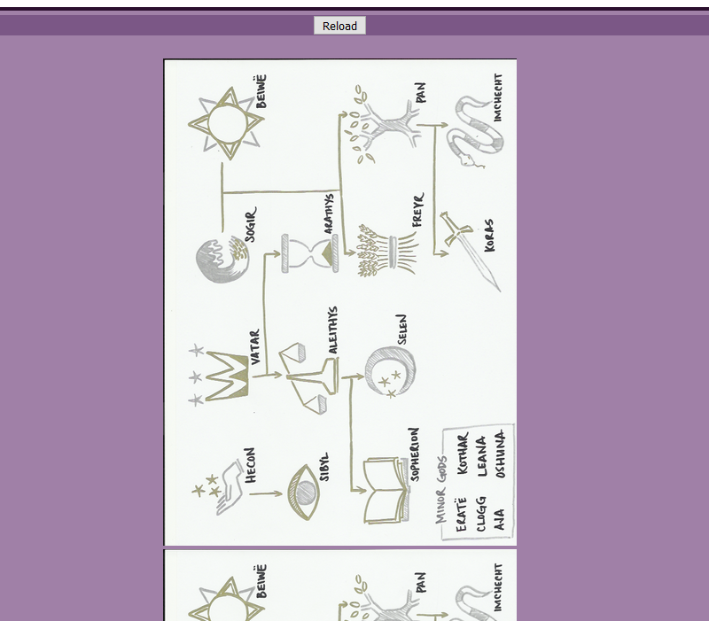

# SCANWEB

Web app interface for sane "scanimage". Enabling scanning on printserver remotely from any web browser.

Built in Erlang using [cowboy](https://github.com/ninenines/cowboy).

(and [Erlang.mk](https://erlang.mk/guide/index.html) as the build system)


## Application

The application provides a web console which is essentially an interface to the [scanimage](http://linuxcommand.org/man_pages/scanimage1.html) unix command with user configurable input for the resolution and colour mode arguments. These are safely fitted to set list to avoid injection attacks.



The app console also provides access to the scanned file, as well as past files all stored in the configured scan directory - Intended for ease of downloading



## Why?

I have a CUPS printserver running on a raspberry pi connected to a usb printer/scanner. CUPS was easy to install and seamless but saned seemed to not work well and no good software seemed available on windows to interface and scan. This app provides a simple featured interface to allow free scanner access to all those on the local network (and wider should appropriate ports be openned)

## Build

Clone 
```
git clone https://github.com/tehsmeely/ScanWeb.git
```
and run make to install deps and build release
```
cd ScanWeb
make
```

run release from release script
```
_rel/scanweb_release/bin/scanweb_release start
```
